# MRR Piece Count

| Element | Description | Image | Back= | Have | Need to Print | Total |
| --- | --- | --- | --- | --- | --- | --- |
| Element0 | Plain Metal Plate (Base) |  |  | 0 | 0 |   |
| Element10 | Straight Arrow (Green) |  |  | 0 | 56 | 56 |
| Element11 | Curved Arrow Right (Green) |  |  | 0 | 32 | 32 |
| Element12 | Curved Arrow Left (Green) |  |  | 0 | 32 | 32 |
| Element11-12 | Curved Arrow Right (Green) |  |  | 0 | 32 | 32 |
| Element12-11 | Curved Arrow Left (Green) |  |  | 0 | 32 | 32 |
| Element13 | Arrow with Corner Brackets (Green) | 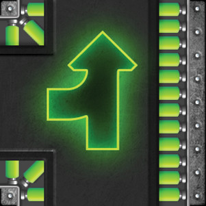 | 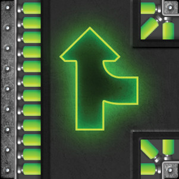 | 0 |   | 4 |
| Element14 | Modular Arrow Component (Green) |  |  | 0 |   | 4 |
| Element15 | Three-Way Arrow (Green) | 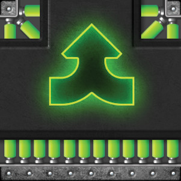 |  | 0 |   | 4 |
| Element20 | Double Straight Arrow (Blue) |  |  | 0 | 24 | 24 |
| Element21 | Curved Arrow Right (Blue) |  |  | 0 | 8 | 8 |
| Element22 | Curved Arrow Left (Blue) | 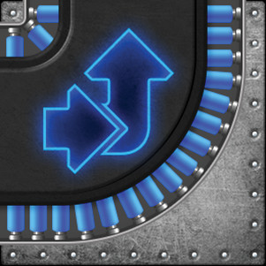 |  | 0 | 8 | 8 |
| Element21-22 | Curved Arrow Right (Blue) |  |  | 0 | 8 | 8 |
| Element22-21 | Curved Arrow Left (Blue) |  |  | 0 | 8 | 8 |
| Element25 | Textured Background (Green) | 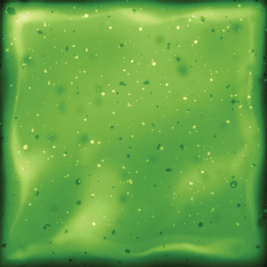 |  | 0 |   | 8 |
| Element26 | Straight Arrow (Green Textured) | 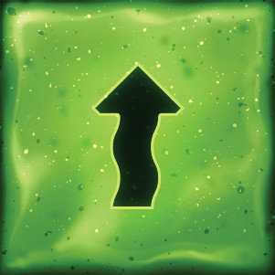 |  | 0 |   | 2 |
| Element27 | Curved Arrow Right (Green Textured) | 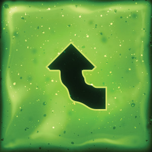 | 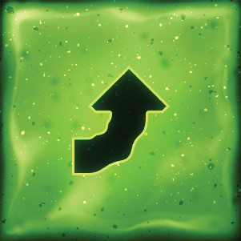 | 0 |   | 2 |
| Element28 | Curved Arrow Round Pivot (Green Textured) |  |  | 0 |   | 2 |
| Element29 | Vortex (Green Textured) | 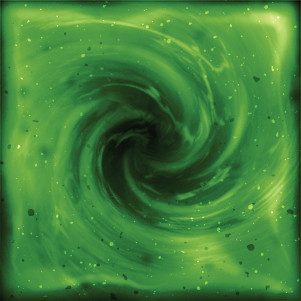 |  | 0 |   | 1 |
| Element31 | Gear with Green Rotation Arrows |  |  | 0 | 6 | 6 |
| Element32 | Gear with Red Rotation Arrows |  |  | 0 | 6 | 6 |
| Element31-32 | Gear with Green Rotation Arrows |  |  | 0 | 1 | 1 |
| Element32-31 | Gear with Red Rotation Arrows |  |  | 0 | 1 | 1 |
| Element33 | Vortex Portal | 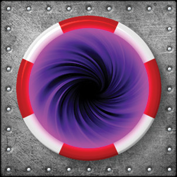 |  | 0 |   |   |
| Element34 | Electrical Hazard Panel | 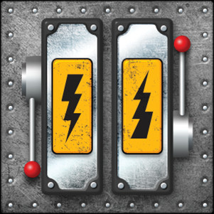 |  | 0 | 8 |   |
| Element40 | Pit |  |  | 0 | 8 |   |
| Element42 | Void Tunnel (Hazard Border Variant A) |  |  | 0 |   |   |
| Element43 | Void Tunnel (Hazard Border Variant B) | 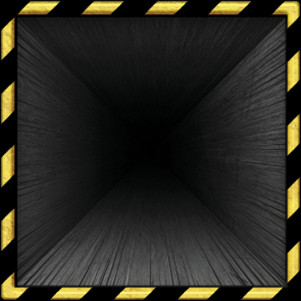 |  | 0 |   |   |
| Element55 | Water Texture | 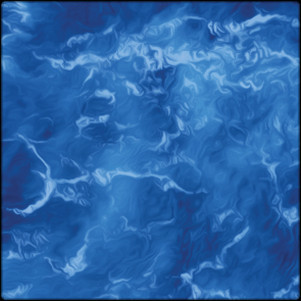 |  | 0 |   | 10 |
| Element56 | Water Straight Arrow | 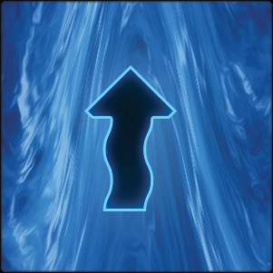 |  | 0 | 20 |   |
| Element57 | Water Curved Arrow Right | 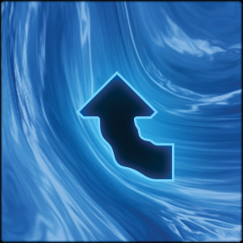 | 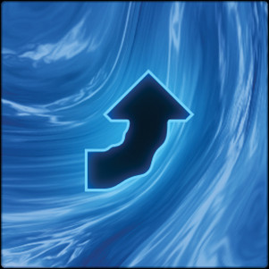 | 0 | 2 |   |
| Element58 | Water Curved Arrow Round Pivot |  |  | 0 | 2 |   |
| Element59 | Water Vortex | 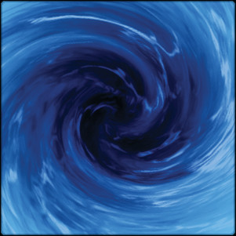 |  | 0 | 1 |   |
| Element61 | Lightning Burst | 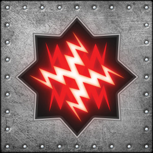 |  | 0 | 2 |   |
| Element70 | Control Dial | 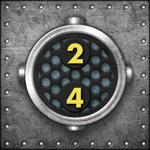 |  | 0 |   |   |
| Element80 | Fire / Explosion | 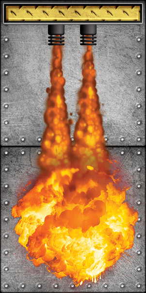 |  | 0 |   |   |
| Element92 | Tool Kit | 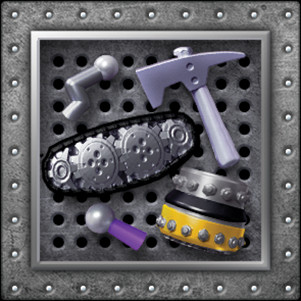 |  | 0 | 5 |   |
| Element100 | Flag Square (need numbers) |  |  | 0 |   |   |
| Element100-1 | Flag Square #1 |  |  | 1 |   | 1 |
| Element100-2 | Flag Square #2 |  |  | 1 |   | 1 |
| Element100-3 | Flag Square #3 |  |  | 1 |   | 1 |
| Element100-4 | Flag Square #4 |  |  | 1 |   | 1 |
| Element100-5 | Flag Square #5 |  |  | 1 |   | 1 |
| Element100-6 | Flag Square #6 |  |  | 1 |   | 1 |
| Element110 | Start Square (need numbers) |  |  | 0 |   |   |
| Element110-1 | Start Square #1 |  |  | 0 | 1 | 1 |
| Element110-2 | Start Square #2 |  |  | 0 | 1 | 1 |
| Element110-3 | Start Square #3 |  |  | 0 | 1 | 1 |
| Element110-4 | Start Square #4 |  |  | 0 | 1 | 1 |
| Element110-5 | Start Square #5 |  |  | 0 | 1 | 1 |
| Element110-6 | Start Square #6 |  |  | 0 | 1 | 1 |
| Element110-7 | Start Square #7 |  |  | 0 | 1 | 1 |
| Element110-8 | Start Square #8 |  |  | 0 | 1 | 1 |
| Element120-A | Reboot Square A |  |  | 0 | 4 | 4 |
| Element120-B | Reboot Square B |  |  | 0 | 4 | 4 |
| Element120-C | Reboot Square C |  |  | 0 | 4 | 4 |
| Element200 | Raised Wall | 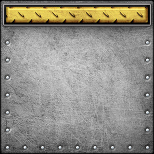 |   | 0 | 16 |   |
| Element201 | Two-Zone Hazard Tile | 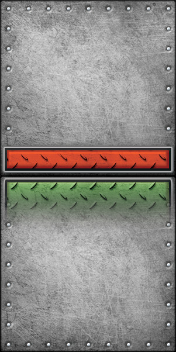 |  | 0 |   |   |
| Element202 | Mechanical Scale | 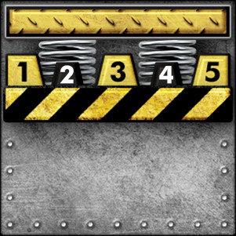 |  | 0 |   |   |
| ElementR | Energy Connection | 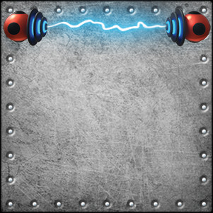 |  | 0 |   |   |
| Element0b | Plain Metal Plate (Variant B) | 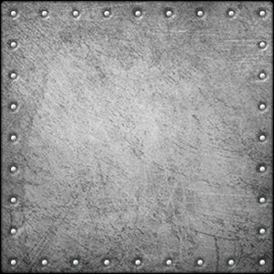 |  | 0 |   |   |
| Element0c | Plain Metal Plate (Variant C) | 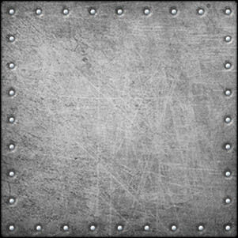 |  | 0 |   |   |
| Element0d | Plain Metal Plate (Variant D) | 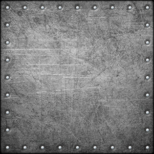 |  | 0 |   |   |
| Element23a | Three-Way Arrow (Blue) | 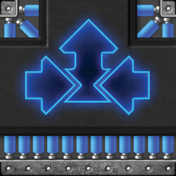 |  | 0 |   | 4 |
| Element23b | Multi-Directional Arrow (Blue) | 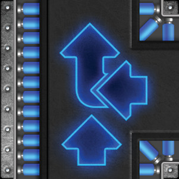 | 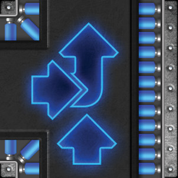 | 0 |   | 4 |
| Element23c | Complex Multi-Direction (Blue) |  |  | 0 |   | 4 |
| Element35a | Hexagon Orange (Red Corner Nodes) | 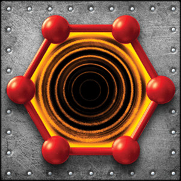 |  | 0 |   |   |
| Element35b | Hexagon Purple (Purple Corner Nodes) | 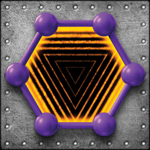 |  | 0 |   |   |
| Element35c | Hexagon Green (Green Corner Nodes) | 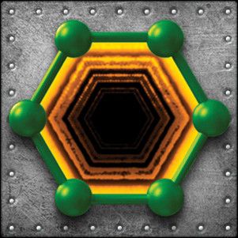 |  | 0 |   |   |
| Element35d | Hexagon Blue (Blue Corner Nodes) | 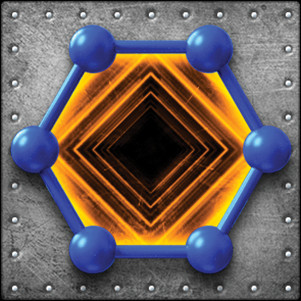 |  | 0 |   |   |
| Element41a | Connector Puzzle Piece (Even Positions) | 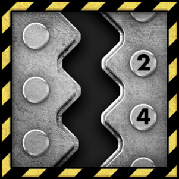 |  | 0 |   |   |
| Element41b | Connector Puzzle Piece (Odd Positions) | 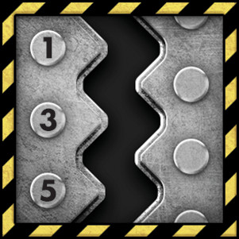 |  | 0 |   |   |
| Element50x | Water Curved Arrow (Variant A) | 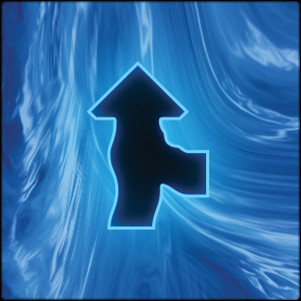 |  | 0 |   | 4 |
| Element50x2 | Water Curved Arrow (Variant B) |  |  | 0 |   | 4 |
| Element50x3 | Water Three-Way Arrow | 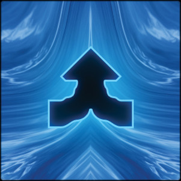 |  | 0 |   | 4 |
| Element81a | Toxic Gas Cloud | 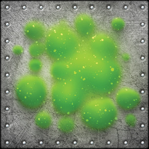 |  | 0 |   |   |
| Element81b | Toxic Gas Cloud (Defined) | 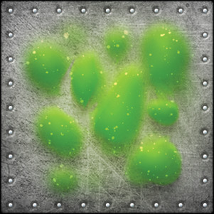 |  | 0 |   |   |
---

# Element Requirements

All elements are **3" × 3" × 1/8"** tiles (76.2 × 76.2 × 3.175 mm) for 3D printing.
The base plate uses the gray brushed-metal aesthetic from Element0.jpg.

---

## Base Plate

### Element0 — Plain Metal Plate (Base)
- Flat top and bottom — no raised surfaces; total height is exactly 1/8"
- **Border:** 1/16" (1.5875 mm) wide black border recessed into the top face, flush within the 3×3 footprint
- **Center field:** mid-gray (e.g. `#848483`)
- **Rivets:** 32 flat circular discs around the perimeter (9 per side, shared corners); light gray (`#C1C4C4`), flush with the top surface — no protrusion above or below the tile
- Rivet inset: 3.5 mm from outer edge; rivet radius: 1.8 mm
- **Variants:** Element0b, Element0c, Element0d — identical spec, alternate surface texture passes

---

## Directional Arrows — Green Series

### Element10 — Straight Arrow (Green)
- Dark gradient background
- Neon green straight arrow pointing **up**, centered
- Rivet border

### Element11 — Curved Arrow Right (Green)
- Dark gradient background
- Neon green arrow curving **up-right** (chevron/bent)
- Rivet border

### Element12 — Curved Arrow with Round Pivot (Green)
- Dark gradient background
- Neon green arrow with **rounded bottom bend**, pointing up-right
- Rivet border

### Element13 — Arrow with Corner Brackets (Green)
- Neon green straight arrow **up** with corner mounting bracket overlays
- Rivet border

### Element14 — Modular Arrow Component (Green)
- Neon green arrow with **partial curved extensions** and corner bracket patterns
- Rivet border

### Element15 — Three-Way Arrow (Green)
- Neon green **tri-arrow** pointing up-left, up, and up-right simultaneously
- Corner bracket overlays
- Rivet border

---

## Directional Arrows — Blue/Cyan Series

### Element20 — Double Straight Arrow (Blue)
- Dark gradient background
- Two cyan/blue neon arrows pointing **up**, stacked
- Rivet border

### Element21 — Curved Arrow Right (Blue)
- Dark gradient background
- Cyan neon arrow curving **up-right**
- Rivet border

### Element22 — Curved Arrow with Round Pivot (Blue)
- Dark gradient background
- Cyan neon arrow with **rounded bottom bend**, pointing up-right
- Rivet border

### Element23a — Three-Way Arrow (Blue)
- Blue neon **tri-arrow**: up-left, up, up-right
- Corner bracket overlays

### Element23b — Multi-Directional Arrow (Blue)
- Two blue neon arrows pointing **up** with sideways arrows
- Corner overlays

### Element23c — Complex Multi-Direction (Blue)
- Blue neon arrows in curved **multi-directional configuration**
- Corner bracket patterns

---

## Directional Arrows — Green Textured Series

### Element25 — Textured Background (Green)
- Bright lime green background with **wavy smoke/liquid texture**, white speckles
- No central graphic — pure background tile

### Element26 — Straight Arrow (Green Textured)
- Lime green textured background
- Black solid arrow pointing **up**, centered
- White speckles throughout

### Element27 — Curved Arrow Right (Green Textured)
- Lime green textured background
- Black curved arrow/chevron pointing **up-right**

### Element28 — Curved Arrow Round Pivot (Green Textured)
- Lime green textured background
- Black curved arrow with **rounded bottom bend**

### Element29 — Vortex (Green Textured)
- Lime green textured background
- Dark **spiral/vortex** swirl pattern, white speckles

---

## Mechanical / Gear Elements

### Element31 — Gear with Green Rotation Arrows
- Silver 8-tooth cogwheel with center hole, concentric rings
- Three **green curved arrows** orbiting the gear
- Rivet border

### Element32 — Gear with Red Rotation Arrows
- Silver 8-tooth cogwheel with center hole, concentric rings
- Three **red curved arrows** orbiting the gear clockwise
- Rivet border

### Element33 — Vortex Portal
- Circular **spiral vortex**, purple center with red accent ring
- Concentric circular patterns

### Element110 — Simple Gear
- Silver circular **cogwheel** (10–12 teeth), metallic center hole
- Plain gray background, no border

### Element92 — Tool Kit
- Gray metal perforated surface
- Hammer, wrench, screwdriver, machine gears, and a purple industrial component arranged on surface
- Rivet border

---

## Hazard / Warning Elements

### Element34 — Electrical Hazard Panel
- Two yellow/gold rectangular panels with black **lightning bolt** symbols
- Red toggle knobs on left and right
- Dual-channel power/hazard indicator

### Element40 — Void Tunnel
- Black funnel/cone with radial perspective lines (depth effect)
- Yellow/gold diagonal **warning stripe** border at top

### Element42 — Void Tunnel (Hazard Border Variant A)
- Black funnel/cone perspective with radial lines
- Yellow/black **diagonal hazard stripe** border

### Element43 — Void Tunnel (Hazard Border Variant B)
- Black funnel/cone perspective with radial lines
- Yellow/black **diagonal hazard stripe** border (alternate stripe width)

### Element200 — Hazard Stripe Bar
- Yellow/gold horizontal bar with **diagonal hazard markings**
- Rivet border

### Element201 — Two-Zone Hazard Tile
- Top half: **red diagonal hazard** markings
- Bottom half: **green diagonal hazard** markings
- Gray metal base

### Element202 — Mechanical Scale
- Yellow/black diagonal striped border
- Numbered scale **1–2–3–4–5** with spring connectors above each number
- Gray metal base

---

## Water / Liquid Series

### Element55 — Water Texture
- Blue water/liquid **ripple texture** with flowing wave patterns
- Light highlights throughout

### Element56 — Water Straight Arrow
- Blue water texture background
- Neon arrow outline pointing **up**

### Element57 — Water Curved Arrow Right
- Blue water texture background
- Curved arrow pointing **up-right**

### Element58 — Water Curved Arrow Round Pivot
- Blue water texture background
- Curved arrow with **rounded bottom bend**

### Element59 — Water Vortex
- Blue **spiral/vortex** swirling water pattern, dark center

### Element50x — Water Curved Arrow (Variant A)
- Blue water texture
- Curved arrow **up-right bend** variation

### Element50x2 — Water Curved Arrow (Variant B)
- Blue water texture
- Alternate **bend pattern** variation

### Element50x3 — Water Three-Way Arrow
- Blue water texture
- **Tri-arrow** or three-way directional flow

---

## Energy / Effect Elements

### Element61 — Lightning Burst
- Red starburst **lightning pattern** radiating outward
- Multiple zigzag points, glowing red light

### Element80 — Fire / Explosion
- Bright orange/red **flame explosion** with yellow center
- Black hazard striped border

### Element81a — Toxic Gas Cloud
- Bright lime green **glowing spheres cluster** with sparkle effects
- Hazardous substance / poison cloud

### Element81b — Toxic Gas Cloud (Defined)
- Bright lime green glowing spheres with more clearly **defined individual bubbles**
- Variant of Element81a

---

## Geometric / Resonance Elements

### Element35a — Hexagon Orange (Red Corner Nodes)
- Hexagonal shape with **concentric circles and lines** (orange/yellow)
- Red spheres at corners

### Element35b — Hexagon Purple (Purple Corner Nodes)
- Hexagonal shape with **triangular striped pattern**
- Purple spheres at corners

### Element35c — Hexagon Green (Green Corner Nodes)
- Hexagonal shape with **diagonal striped pattern**
- Green spheres at corners

### Element35d — Hexagon Blue (Blue Corner Nodes)
- Hexagonal shape with **diamond/square striped pattern**
- Blue spheres at corners

---

## Interface / Connector Elements

### Element41a — Connector Puzzle Piece (Even Positions)
- Gray metal plate with **zigzag/serpentine edge** on left side
- Numbered circles: **2, 4** on right
- Yellow/black hazard border

### Element41b — Connector Puzzle Piece (Odd Positions)
- Gray metal plate with **zigzag/serpentine edge** on left side
- Numbered circles: **1, 3, 5** on right
- Yellow/black hazard border

### Element70 — Control Dial
- Black circular **dial with metallic rim**
- Yellow numbers **2, 4** on dial face
- Gray background, rivet holes

---

## Miscellaneous

### ElementR — Energy Connection
- Two **red spheres** on left and right
- Connected by a blue **sine wave / waveform** line
- Represents electrical connection or energy transfer
- Rivet border

---

## Built SCAD Elements — Frame IDs & Renders

The elements below have working SCAD implementations in `scad/`. Each uses the shared
`frame_with_id(colors = [])` module to mark its identity: a 6-slot array, one slot per
sixth of the frame, repeated identically on all four edges (bottom/right read in
reverse — slot `5-i` — so the pattern is consistent when the tile is flipped). A slot
set to `undef` leaves that segment plain black; any other value is the color painted
into it. Renders below are OpenSCAD `--camera` snapshots from `Images/png/` (top =
`CAMERA_T`, bottom = `CAMERA_B`); "Original" is the reference design image from
`Images/`.

### Base Plate & Belt Tiles

| Element | Frame ID Colors | Top | Bottom | Original |
|---|---|---|---|---|
| element0 | `[lightgray, undef, undef, undef, undef, lightgray]` |  | 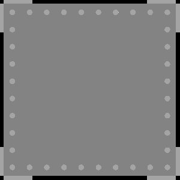 |  |
| element10 | `[undef, undef, green, green, undef, undef]` |  | 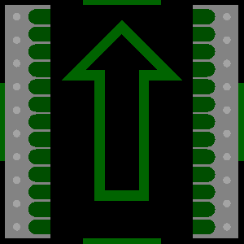 |  |
| element11 | `[undef, undef, green, green, green, green]` | 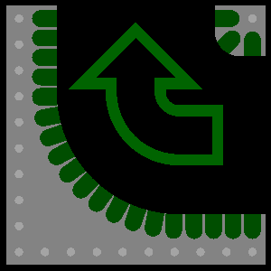 | 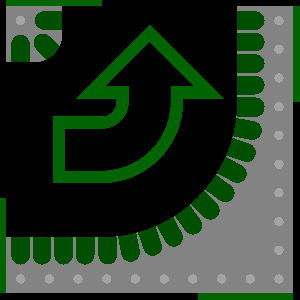 |  |
| element12 | `[undef, undef, green, green, green, green]` | 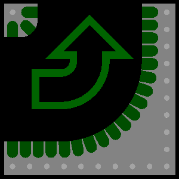 | 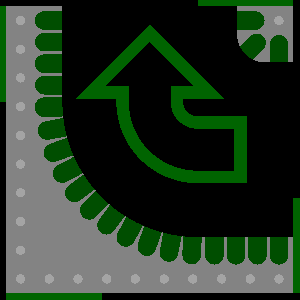 |  |
| element20 | `[undef, undef, blue, blue, undef, undef]` | 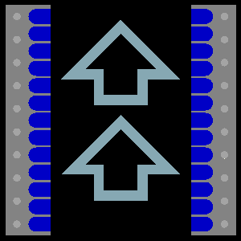 | 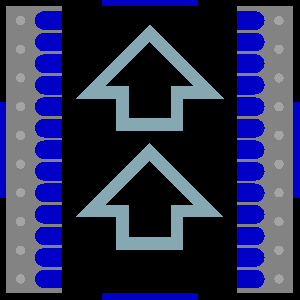 |  |
| element21 | `[undef, undef, blue, blue, blue, blue]` | 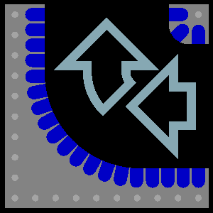 |  |  |
| element22 | `[undef, undef, blue, blue, blue, blue]` |  |  |  |

### Mechanical Gear Tiles

| Element | Frame ID Colors | Top | Bottom | Original |
|---|---|---|---|---|
| element31 | `[undef, green, undef, undef, green, undef]` |  |  |  |
| element32 | `[undef, red, undef, undef, red, undef]` |  |  |  |

### Flag Tiles (element100 family)

| Element | Frame ID Colors | Top | Bottom | Original |
|---|---|---|---|---|
| element100-1 | `[undef, red, red, red, red, red]` |  |  |  |
| element100-2 | `[red, undef, red, red, red, red]` |  |  |  |
| element100-3 | `[red, red, undef, red, red, red]` |  |  |  |
| element100-4 | `[red, red, red, undef, red, red]` |  |  |  |
| element100-5 | `[red, red, red, red, undef, red]` |  |  |  |
| element100-6 | `[red, red, red, red, red, undef]` |  |  |  |

### Start Tiles (element110 family)

| Element | Frame ID Colors | Top | Bottom | Original |
|---|---|---|---|---|
| element110-1 | `[undef, green, green, green, green, green]` |  |  |  |
| element110-2 | `[green, undef, green, green, green, green]` |  |  |  |
| element110-3 | `[green, green, undef, green, green, green]` |  |  |  |
| element110-4 | `[green, green, green, undef, green, green]` |  |  |  |
| element110-5 | `[green, green, green, green, undef, green]` |  |  |  |
| element110-6 | `[green, green, green, green, green, undef]` |  |  |  |
| element110-7 | `[undef, green, green, green, green, undef]` |  |  |  |
| element110-8 | `[green, undef, green, green, green, undef]` |  |  |  |

### Vortex Portal Tiles (element120 family)

| Element | Frame ID Colors | Top | Bottom | Original |
|---|---|---|---|---|
| element120-A | `[undef, orange, orange, orange, orange, orange]` |  |  |  |
| element120-B | `[orange, undef, orange, orange, orange, orange]` |  |  |  |
| element120-C | `[orange, orange, undef, orange, orange, orange]` |  |  |  |

---

## Common Specifications

| Property | Value |
|----------|-------|
| Width | 3.000 in (76.2 mm) |
| Height | 3.000 in (76.2 mm) |
| Depth | 0.125 in (3.175 mm) |
| Border width | 7.0 mm |
| Border height | 0.0625 in (1.5875 mm) raised |
| Rivet count | 32 (9 per side, corners shared) |
| Rivet inset | 3.5 mm from outer edge |
| Rivet radius | 1.8 mm |
| Rivet style (Element0) | Flat disc, light gray (`#C1C4C4`), flush with top and bottom — no protrusion |
| Output format | Binary STL |
